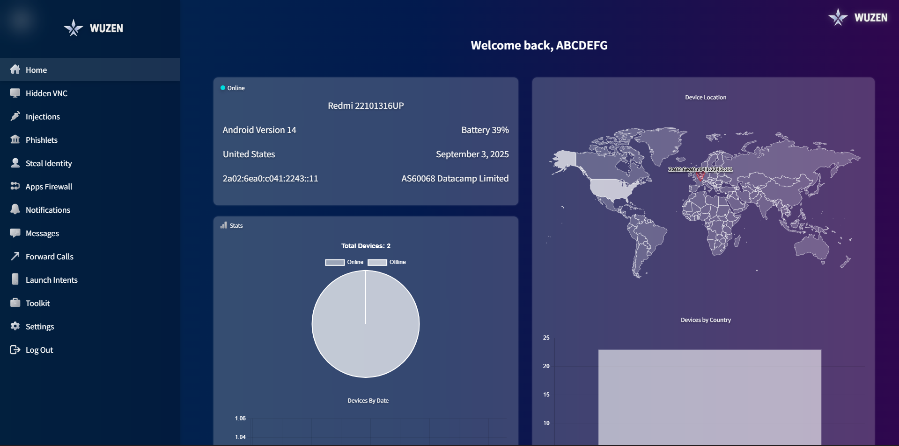
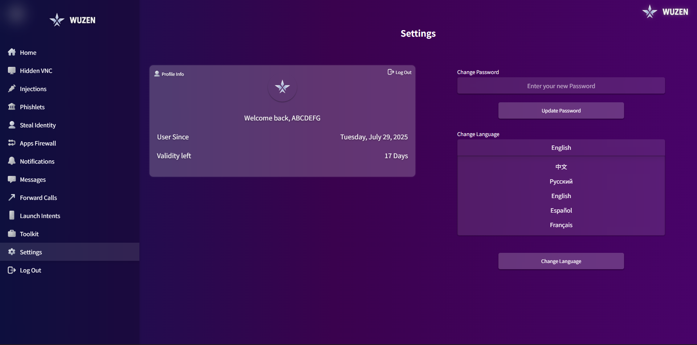
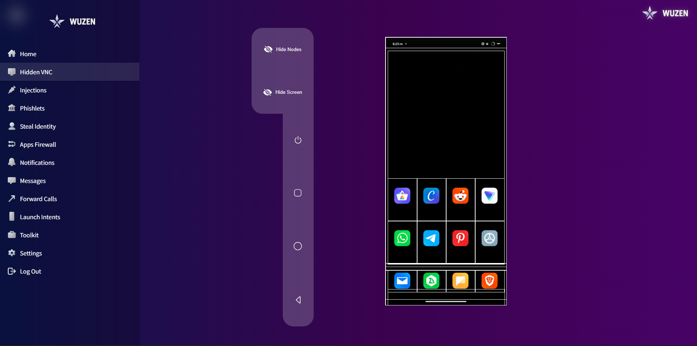
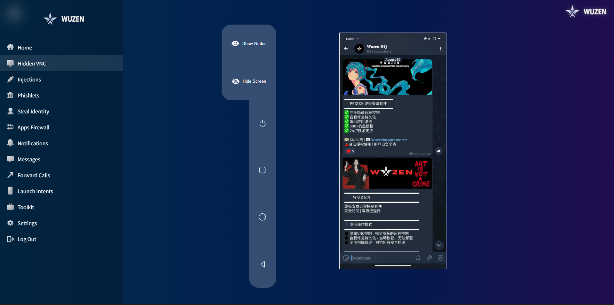
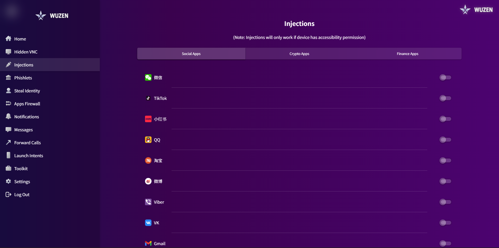
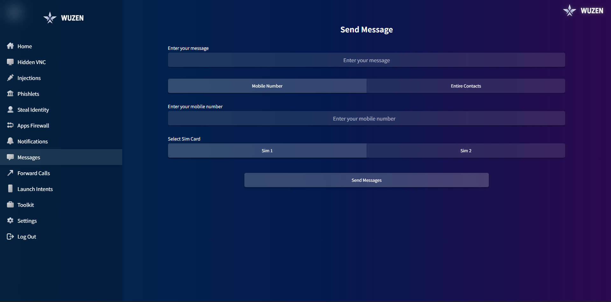
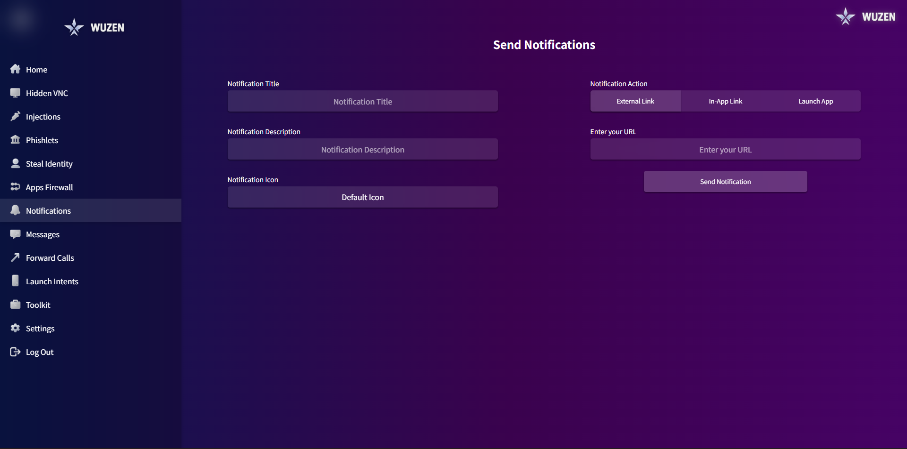
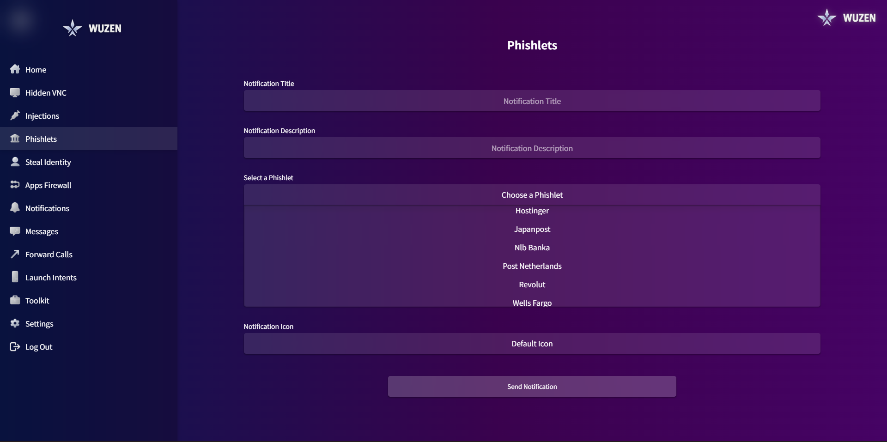
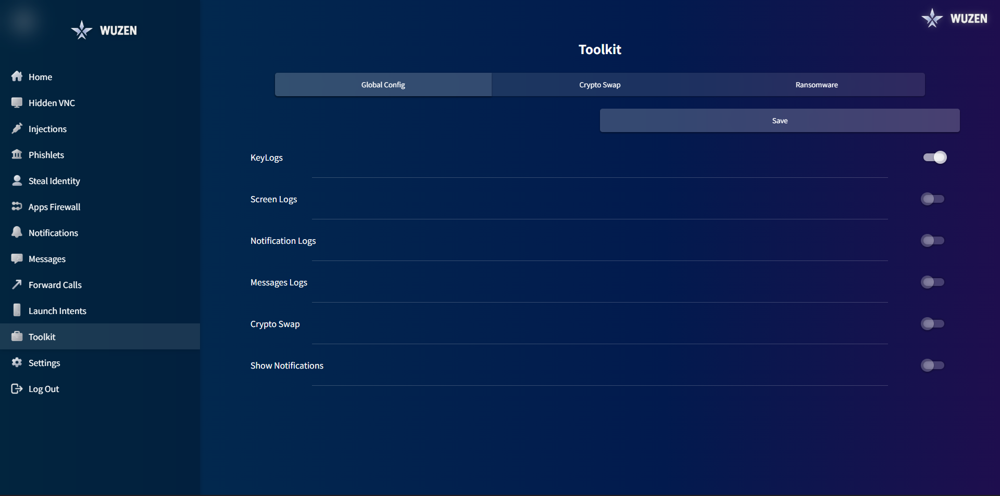

<div align="center">

<!-- SEO Meta Keywords: FUD, GPP, WUZENRAT, Telegrambasedrat, WUZEN RAT, APK Builder, Android APK Generator, WebView APK, Custom APK Builder, WUZEN 2026, Android App Builder Panel, APK Sign Tool, One-Click APK, Node.js APK Panel -->

```
██╗    ██╗██╗   ██╗███████╗███████╗███╗   ██╗
██║    ██║██║   ██║╚══███╔╝██╔════╝████╗  ██║
██║ █╗ ██║██║   ██║  ███╔╝ █████╗  ██╔██╗ ██║
██║███╗██║██║   ██║ ███╔╝  ██╔══╝  ██║╚██╗██║
╚███╔███╔╝╚██████╔╝███████╗███████╗██║ ╚████║
 ╚══╝╚══╝  ╚═════╝ ╚══════╝╚══════╝╚═╝  ╚═══╝
```

# ⚡ WUZEN — R4T 2026

**Build. Brand. Deploy. — One Panel to Rule Them All.**

[](https://nodejs.org)
[](https://openjdk.org)
[](LICENSE)
[](https://ubuntu.com)
[](https://developer.android.com)
[]()

> 🚀 **WUZEN** is a powerful web-based control panel that lets you generate custom, signed Android APKs in minutes — no Android Studio, no complex builds, no tears.

</div>

---

## 📑 Table of Contents

- [✨ What Is WUZEN?](#-what-is-wuzen)
- [🌟 Features](#-features)
- [⚙️ Prerequisites](#️-prerequisites)
- [📦 Installation](#-installation)
  - [⚡ Quick Start (Recommended)](#-quick-start-recommended)
  - [🛠️ Manual Setup](#️-manual-setup-full-control)
- [🔧 Configuration](#-configuration)
- [🖥️ Accessing the Panel](#️-accessing-the-panel)
- [📱 Building Your First APK](#-building-your-first-apk)
- [🔒 Security](#-security)
- [🐛 Troubleshooting](#-troubleshooting)
- [🤝 Contributing](#-contributing)

---
## 🌐 Web Panel (PC View)
<details open>
  <summary>📂 Click to expand Web Panel screenshots</summary>
  <br>

  <p align="center">
    <a href="assets/wupics/pcview/Dashboard.png"></a>
    <a href="assets/wupics/pcview/Settings.png"></a>
  </p>

  <p align="center">
    <a href="assets/wupics/pcview/App firewall.png"></a>
    <a href="assets/wupics/pcview/Forward calls.png"></a>
  </p>

  <p align="center">
    <a href="assets/wupics/pcview/HVNC.png"></a>
    <a href="assets/wupics/pcview/VNC.png"></a>
  </p>

  <p align="center">
    <a href="assets/wupics/pcview/Injections.png"></a>
    <a href="assets/wupics/pcview/Injections 2.png"></a>
    <a href="assets/wupics/pcview/Injections 3.png"></a>
  </p>

  <p align="center">
    <a href="assets/wupics/pcview/Launch Intents.png"></a>
    <a href="assets/wupics/pcview/Launch Intents 2.png"></a>
  </p>

  <p align="center">
    <a href="assets/wupics/pcview/Login page.png"></a>
    <a href="assets/wupics/pcview/Messages.png"></a>
  </p>

  <p align="center">
    <a href="assets/wupics/pcview/Notifications.png"></a>
    <a href="assets/wupics/pcview/Phislets.png"></a>
  </p>

  <p align="center">
    <a href="assets/wupics/pcview/Steal Indentity.png"></a>
    <a href="assets/wupics/pcview/Toolkit.png"></a>
  </p>

  <p align="center">
    <a href="assets/wupics/pcview/Toolkit 2.png"></a>
    <a href="assets/wupics/pcview/Toolkit 3.png"></a>
  </p>
</details>

---

## 📱 Telegram Panel (Tele View)
<details open>
  <summary>📂 Click to expand Telegram Panel screenshots</summary>
  <br>

  <p align="center">
    <a href="assets/wupics/Tele view/Wuzen panel 1.jpg"></a>
    <a href="assets/wupics/Tele view/Wuzen panel 2.jpg"></a>
    <a href="assets/wupics/Tele view/Wuzen Panel 3.jpg"></a>
  </p>

  <p align="center">
    <a href="assets/wupics/Tele view/Wuzen panel 4.jpg"></a>
    <a href="assets/wupics/Tele view/Wuzen panel 5.jpg"></a>
    <a href="assets/wupics/Tele view/Wuzen panel 6.jpg"></a>
  </p>
</details>
---

## ✨ What Is WUZEN?

**WUZEN Application Builder** is a self-hosted, Node.js-powered web panel that allows anyone — even beginners — to generate custom branded Android APKs directly from a browser interface.

No coding knowledge required. Just configure, upload your logo, hit **Build**, and download your APK.

```
Browser → WUZEN Panel → Build Script → Signed APK ✅
```

---

## 🌟 Features

| Feature | Description |
|---|---|
| 🔧 **One-Click APK Build** | Generate APKs from a simple web form — no terminal needed |
| 🎨 **Custom Branding** | Upload your own logo, set your app name |
| 🌐 **WebView Integration** | Wrap any URL into a native Android app instantly |
| 🔐 **Signed APK Output** | All builds are signed and ready for installation |
| ⚡ **Fast Builds** | Optimized build pipeline powered by apktool + apksigner |
| 📋 **Live Build Logs** | Watch your APK compile in real-time via the log panel |
| 🖥️ **Web-Based Panel** | Accessible from any browser on your network |

---

## ⚙️ Prerequisites

> ⚠️ **Before you begin**, make sure your server or VPS is running **Ubuntu/Debian Linux**.  
> Windows is NOT supported natively. Use WSL2 or a Linux VPS.

You'll need the following installed:

| Tool | Version | Why It's Needed |
|---|---|---|
| **nvm** | Latest | Manages Node.js versions cleanly |
| **Node.js** | v24 LTS | Runs the WUZEN web panel |
| **OpenJDK** | 17+ | Required by APK tools (Java dependency) |
| **apktool** | 2.9.3+ | Decodes and rebuilds APK files |
| **apksigner** | via Android Build Tools | Signs APKs so they can be installed |
| **PM2** | Latest | Keeps the panel running in the background |

---

## 📦 Installation

### Step 1 — Clone the Repository

```bash
git clone <your-repo-url>
cd <repo-folder>
```

---

### ⚡ Quick Start (Recommended)

> ✅ Best for beginners. The build script handles most of the setup automatically.

```bash
# Step 1: Configure your server settings FIRST (required)
nano json/config.json

# Step 2: Give the script execute permission
chmod +x build.sh

# Step 3: Run the builder
./build.sh
```

> ⚠️ **Do NOT skip Step 1.** The panel will not work correctly without configuring `config.json` first.

---

### 🛠️ Manual Setup (Full Control)

> Use this method if the quick start fails or you want full control over each component.

---

#### 1️⃣ Install NVM (Node Version Manager)

```bash
curl -o- https://raw.githubusercontent.com/nvm-sh/nvm/v0.39.7/install.sh | bash
source ~/.bashrc
```

Verify:
```bash
nvm --version
```

---

#### 2️⃣ Install Node.js v24 LTS

```bash
nvm install 24
nvm use 24
node --version   # Should output v24.x.x
```

---

#### 3️⃣ Install OpenJDK 17

```bash
sudo apt update
sudo apt install openjdk-17-jdk -y
java -version    # Should output openjdk 17.x.x
```

---

#### 4️⃣ Install apktool (Latest — Manual Method)

> ⚠️ **Do NOT use** `apt install apktool` — the apt version is often outdated and will cause build failures.

```bash
# Download the latest apktool JAR
wget https://bitbucket.org/iBotPeaches/apktool/downloads/apktool_2.9.3.jar -O apktool.jar

# Download the Linux wrapper script
wget https://raw.githubusercontent.com/iBotPeaches/Apktool/master/scripts/linux/apktool -O apktool

# Give execute permissions
chmod +x apktool

# Move both files to system path
sudo mv apktool.jar /usr/local/bin/apktool.jar
sudo mv apktool /usr/local/bin/apktool
```

Verify:
```bash
apktool --version
```

---

#### 5️⃣ Install apksigner (via Android Build Tools)

> ⚠️ **Do NOT use** `apt install apksigner` — it may be outdated or broken on many systems.

```bash
# Install dependencies
sudo apt install unzip wget -y

# Download Android command-line tools
wget https://dl.google.com/android/repository/commandlinetools-linux-latest.zip

# Extract into the right folder structure
mkdir -p $HOME/android/cmdline-tools
unzip commandlinetools-linux-latest.zip -d $HOME/android/cmdline-tools

# Set environment variables (add these to ~/.bashrc for persistence)
export ANDROID_HOME=$HOME/android
export PATH=$ANDROID_HOME/cmdline-tools/cmdline-tools/bin:$ANDROID_HOME/platform-tools:$PATH

# Accept licenses and install build tools
yes | sdkmanager --licenses
sdkmanager "build-tools;34.0.0"
```

> 💡 **Tip:** Add the `export` lines to your `~/.bashrc` file so they persist after reboot:
> ```bash
> echo 'export ANDROID_HOME=$HOME/android' >> ~/.bashrc
> echo 'export PATH=$ANDROID_HOME/cmdline-tools/cmdline-tools/bin:$ANDROID_HOME/platform-tools:$PATH' >> ~/.bashrc
> source ~/.bashrc
> ```

Verify:
```bash
apksigner version
```

---

#### 6️⃣ Install Project Dependencies

```bash
npm install
```

---

#### 7️⃣ Install PM2 (Process Manager)

PM2 keeps your panel running even after you close the terminal or reboot.

```bash
npm install -g pm2

# Start the panel
pm2 start index.js --name "wuzen-panel"

# Auto-restart on system reboot
pm2 startup
pm2 save
```

---

## 🔧 Configuration

> ⚠️ **This step is required before running the panel.** Skipping it will cause connection errors.

Open the configuration file:

```bash
nano json/config.json
```

Find the `def` section and update these two values:

```json
"def": {
  "host": "YOUR_SERVER_IP_OR_DOMAIN",
  "port": "3000"
}
```

| Field | What to Put Here | Example |
|---|---|---|
| `host` | Your VPS IP address or domain name | `192.168.1.10` or `yourdomain.com` |
| `port` | The port the panel will run on | `3000` |

**Example (local test):**
```json
"def": {
  "host": "localhost",
  "port": "3000"
}
```

**Example (VPS/production):**
```json
"def": {
  "host": "203.0.113.45",
  "port": "3000"
}
```

Save and exit: `Ctrl+X` → `Y` → `Enter`

---

## 🖥️ Accessing the Panel

Once the panel is running, open your browser and go to:

```
http://YOUR_HOST:3000
```

**First-time login:**

1. Enter your **activation key** when prompted
2. Log in with the default password:

```
Password: WUZEN
```

> 🔴 **IMPORTANT:** Change the default password immediately after your first login. See [Security](#-security) below.

---

## 📱 Building Your First APK

Follow these steps inside the WUZEN panel:

```
Step 1 → Click "Build APK" in the panel
Step 2 → Upload your App Logo (PNG recommended, 512×512px)
Step 3 → Enter your App Name
Step 4 → Set the Host & Port for the app's backend
Step 5 → Enter the WebView URL (the website/app URL to wrap)
Step 6 → Click "Build" and wait
Step 7 → Scroll down to the Logs section
Step 8 → Download your signed APK ✅
```

> ⏳ Build time is typically **1–5 minutes** depending on server performance.  
> Do not close or refresh the browser while building.

---

## 🔒 Security

> 🚨 **These steps are critical if your panel is accessible over the internet.**

- [ ] **Change the default password** (`WUZEN`) immediately after first login
- [ ] **Do not expose the panel publicly** without proper authentication
- [ ] **Use HTTPS** in production (set up a reverse proxy with Nginx + Let's Encrypt)
- [ ] **Restrict access by IP** using a firewall (e.g., `ufw`) if possible
- [ ] **Keep dependencies updated** regularly

**Basic firewall setup (optional but recommended):**
```bash
sudo ufw allow 22      # SSH
sudo ufw allow 3000    # WUZEN Panel
sudo ufw enable
```

---

## 🐛 Troubleshooting

<details>
<summary><b>🔴 Port already in use</b></summary>

```bash
lsof -i :3000          # Find what's using port 3000
kill -9 <PID>          # Kill that process
pm2 restart wuzen-panel
```
</details>

<details>
<summary><b>🔴 Permission denied on build.sh</b></summary>

```bash
chmod +x build.sh
./build.sh
```
</details>

<details>
<summary><b>🔴 Java not found / Java errors</b></summary>

```bash
java -version          # Check if Java is installed
sudo apt install openjdk-17-jdk -y   # Reinstall if missing
```
</details>

<details>
<summary><b>🔴 apktool: command not found</b></summary>

Re-run the manual apktool install steps. Make sure both files are in `/usr/local/bin/`:
```bash
ls /usr/local/bin/ | grep apktool
```
</details>

<details>
<summary><b>🔴 apksigner not found after installation</b></summary>

Make sure your environment variables are set:
```bash
source ~/.bashrc
apksigner version
```
If still missing, re-run the `sdkmanager "build-tools;34.0.0"` step.
</details>

<details>
<summary><b>🔴 npm install fails</b></summary>

```bash
nvm use 24             # Make sure you're on the right Node version
node --version         # Confirm v24.x.x
npm install            # Retry
```
</details>

<details>
<summary><b>🔴 Panel not loading in browser</b></summary>

1. Check PM2 is running: `pm2 status`
2. Check your config.json host/port match what you're visiting
3. Check firewall isn't blocking the port: `sudo ufw status`
</details>

---

## 🤝 Contributing

Contributions are welcome! Here's how to get involved:

1. **Fork** this repository
2. **Create** a feature branch: `git checkout -b feature/your-feature`
3. **Commit** your changes: `git commit -m 'Add your feature'`
4. **Push** to the branch: `git push origin feature/your-feature`
5. **Open** a Pull Request

Please open an **Issue** first for major changes so we can discuss the approach.

---

## 📜 License

This project is licensed under the **MIT License** — see the [LICENSE](LICENSE) file for details.

---

<div align="center">

**Built with ❤️ by the WUZEN Team — 2026**

*If this project helped you, consider giving it a ⭐ — it helps more people find it!*

</div>
